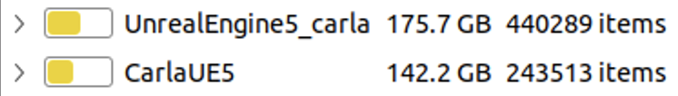

# 🚗 CARLA Unreal Engine 5.5 Installation Guide

Guide to install CARLA on **Ubuntu 22.04** using **Unreal Engine 5.5**

---

## 📋 Table of Contents

* [💻 Recommended system](#recommended-system)
* [🛠️ Installation](#installation)
* [🐞 Troubleshooting](#troubleshooting)
* [🔗 References](#references)

---


## 💻 Recommended system

* Intel i7 gen 9th - 11th / Intel i9 gen 9th - 11th / AMD Ryzen 7 / AMD Ryzen 9
* +32 Gb RAM memory 
* NVIDIA RTX 3070/3080/3090 / NVIDIA RTX 4090 or better
* 16 Gb or more VRAM
* Ubuntu 22.04 or Windows 11

## 🛠️ Installation

### **Step 1:** Clone the CARLA repository

```bash
git clone -b ue5-dev https://github.com/carla-simulator/carla.git CarlaUE5
```

### **Step 2:** Get Unreal Engine 5.5 repository

To build CARLA, you need a special version of Unreal Engine 5.5 prepared for CARLA.
First, connect your GitHub account to Epic Games: [Epic's Unreal Engine on GitHub](https://www.unrealengine.com/en-US/ue-on-github).

Once authorized, **clone Unreal Engine 5.5** (must be on the same commit as recommended by CARLA docs).

### **Step 3:** Set Git local credentials

Edit your Bash configuration:

```bash
code ~/.bashrc
```

Add this line to the end (replace with your actual info):

```bash
export GIT_LOCAL_CREDENTIALS=[Your_Username]@[Your_Token]
```

> Replace `[Your_Username]` and `[Your_Token]` with your GitHub username and a personal access token (PAT).

Reload the config:

```bash
source ~/.bashrc
```

### **Step 4:** Build CARLA

```bash
cd CarlaUE5
sudo -E ./CarlaSetup.sh
```

> This will download and install Unreal Engine 5.5, prerequisites, and build CARLA.
> **Note:** This process can take several hours and uses a lot of disk space.
>
> <p align="center">
>  
> </p>

### **Step 5:** Launch CARLA in Unreal Editor

```bash
cmake --build Build --target launch
```


### **Step 6:** Build the CARLA package

```bash
cmake --build Build --target package
```

The generated package will be in `CarlaUE5/Build/Package`.

### **Step 7:** Run the CARLA package

Navigate to the package directory:

```bash
cd CarlaUE5/Build/Package/Carla-0.10.0-Linux-Shipping/Linux
```

Launch CARLA:

```bash
./CarlaUnreal.sh -prefernvidia -nosound 
```

**For ROS2 interface:**

```bash
./CarlaUnreal.sh -prefernvidia -nosound --ros2
```


---

## 🐞 Troubleshooting

### ⚠️ CMake Version Error

If you see:

```
CMake Error at CMakeLists.txt:16 (cmake_minimum_required):
  CMake 3.27.2 or higher is required. You are running version 3.22.1
```

Check your active CMake version:

```bash
cmake --version
# Should show: cmake version 3.28.3 (or newer)
```

If `sudo cmake --version` shows an old version:

```bash
sudo cmake --version
# cmake version 3.22.1 (wrong)
```

**Solution:**
Edit `CarlaSetup.sh` to explicitly set the desired CMake path. For example:

```bash
/opt/cmake-3.28.3-linux-x86_64/bin/cmake -G Ninja -S . -B Build \
    --toolchain=$PWD/CMake/Toolchain.cmake \
    -DLAUNCH_ARGS="-prefernvidia" \
    -DCMAKE_BUILD_TYPE=Release \
    -DENABLE_ROS2=ON \
    -DPython_ROOT_DIR=${python_root} \
    -DPython3_ROOT_DIR=${python_root} \
    -DCARLA_UNREAL_ENGINE_PATH=$CARLA_UNREAL_ENGINE_PATH
```

### 🔒 Permissions Error

If you see a permission error during build:

```bash
sudo chown -R $(whoami):$(whoami) Build/
# Or for your workspace:
sudo chown -R $(whoami):$(whoami) /path/to/CarlaUE5/Build/
```

Example:

```bash
sudo chown -R $(whoami):$(whoami) /media/peeradon/Peeradon-SSD/CarlaUE5/Build
```

---

## 🔗 References

* [📚 CARLA Documentation](https://carla-ue5.readthedocs.io/en/latest/)
* [💻 CARLA GitHub Repository](https://github.com/carla-simulator/carla.git)

