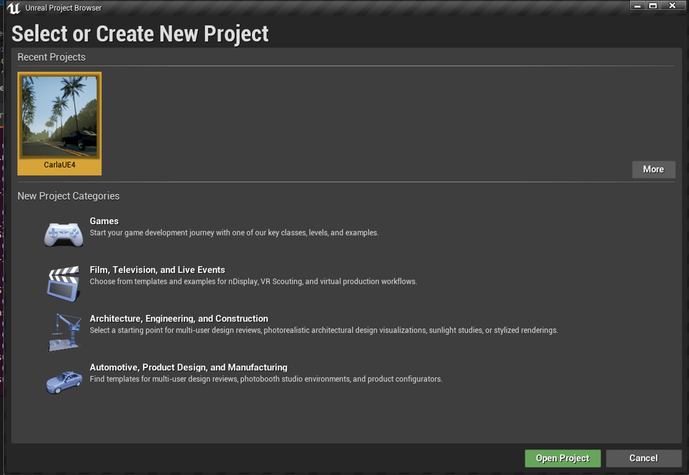

# 🚗 CARLA Unreal Engine 4 Installation Guide

Guide for installing CARLA on **Ubuntu 22.04** using **Unreal Engine 4**

---

## 📋 Table of Contents

* [💻 Recommended System](#-recommended-system)
* [⚡ Quick Installation](#-quick-installation)  <- Recommended do if you want to quickly set up CARLA
* [🛠️ Installation](#-installation)
* [🔗 References](#-references)

---

## 💻 Recommended System

* Intel i7/i9 9th–11th gen, or AMD Ryzen 7/9
* 32 GB RAM or more
* NVIDIA RTX 3070/3080/3090/4090 (16 GB VRAM or more)
* Ubuntu 22.04 (Windows 11 is also supported, but this guide covers Linux)

---
## ⚡ Quick Installation
This guide to install binary CARLA on Ubuntu 22.04 using Unreal Engine 4 is designed for users who want to quickly set up CARLA without building from source.

### **Step 1: Install Carlar Binary**
Plase Dowload form Here [CARLA_0.9.15.tar.gz](https://tiny.carla.org/carla-0-9-15-linux)

### **Step 2: Setup Work directory and Extract the Archive**

```bash
cd ~/Downloads
## Copy the downloaded file to your home directory
cp CARLA_0.9.15.tar.gz ~/
## Extract the CARLA archive to a directory named carla_simulator in your home directory
mkdir -p ~/carla_simulator
## Extract the contents of the CARLA archive
tar -xvzf CARLA_0.9.15.tar.gz -C ~/carlar_simulator
```

### **Step 3: Install CARLA Python API**

First Dowload the Carlar Python API Wheel file from [CARLA Python API .whl](/gezp/carla_ros/releases/download/carla-0.9.15-ubuntu-22.04/carla-0.9.15-cp310-cp310-linux_x86_64.whl) and [CARLAR Python API .egg](/gezp/carla_ros/releases/download/carla-0.9.15-ubuntu-22.04/carla-0.9.15-py3.10-linux-x86_64.egg)

And place it in the `~/carla_simulator/PythonAPI/carla/dist/`

```bash
cd ~/Downloads
## Copy the downloaded wheel file to the CARLA Python API directory
cp carla-0.9.15-cp310-cp310-linux_x86_64.whl ~/carla_simulator/PythonAPI/carla/dist/
cp carla-0.9.15-py3.10-linux-x86_64.egg ~/carla_simulator/PythonAPI/carla/dist/
```

Then install the CARLA Python API using pip:

```bash
cd ~/carlar_simulator/PythonAPI/carla/dist/
pip install carla-0.9.15-cp310-cp310-linux_x86_64.whl
```
Then test the installation by running a simple Python script:

```bash
python3 -c "import carla; print('CARLA Python API installed successfully!')"
```
> [!NOTE]
> *If you see the message "CARLA Python API installed successfully!", the installation was successful.*
> *You can now use the CARLA Python API in your projects.*

### **Step 4: Let’s update the paths for Carla in `~/.bashrc`

First open `~/.bashrc`

```bash
code ~/.bashrc
```
Set paths in `~/.bashrc`

```bash
export CARLA_ROOT=/home/$(whoami)/carla_simulator
export PYTHONPATH=$PYTHONPATH:${CARLA_ROOT}/PythonAPI/carla/dist/carla-0.9.14-py3.10-linux-x86_64.egg
```
Then apply the changes:

```bash
source ~/.bashrc
```

### **Step 5: Run CARLA**
Now you can run CARLA by executing the following command:
```bash
cd ~/carla_simulator
./CarlaUE4.sh -prefernvidia
```
It should see Carlar below:


> [!NOTE]
> For detailed build steps, see the [Installation](#-installation) section below.

## 🛠️ Installation

### **Step 1: Install Software Requirements**

```bash
sudo apt-add-repository "deb http://archive.ubuntu.com/ubuntu focal main universe"
sudo apt-get update
sudo apt-get install build-essential clang-10 lld-10 g++-7 cmake ninja-build libvulkan1 python python3 python3-dev python3-pip libpng-dev libtiff5-dev libjpeg-dev tzdata sed curl unzip autoconf libtool rsync libxml2-dev git git-lfs
sudo update-alternatives --install /usr/bin/clang++ clang++ /usr/lib/llvm-10/bin/clang++ 180
sudo update-alternatives --install /usr/bin/clang clang /usr/lib/llvm-10/bin/clang 180
sudo update-alternatives --install /usr/bin/g++ g++ /usr/bin/g++-7 180
```

### **Step 2: Install Python Dependencies**

```bash
pip install --user setuptools
pip3 install --user -Iv setuptools
pip install --user distro
pip3 install --user distro
pip install --user wheel
pip3 install --user wheel auditwheel==4.0.0
```

### **Step 3: Clone Unreal Engine 4**

> [!NOTE]
> You need a GitHub account linked to Epic Games. Follow [this guide](https://www.unrealengine.com/en-US/ue-on-github) if you haven’t set this up.

```bash
git clone --depth 1 -b carla https://{YOUR_TOKEN}@github.com/CarlaUnreal/UnrealEngine.git ~/UnrealEngine_4.26
```

Replace `{YOUR_TOKEN}` with your GitHub personal access token.

---

### **Step 4: Build and Launch Unreal Engine 4**

```bash
cd ~/UnrealEngine_4.26
./Setup.sh && ./GenerateProjectFiles.sh && make
```

> *This process can take 1–2 hours depending on your hardware.*

To test the installation, run:

```bash
cd ~/UnrealEngine_4.26/Engine/Binaries/Linux
./UE4Editor
```

You should see the Unreal Engine 4 editor GUI appear.



---

### **Step 5: Clone the CARLA Repository**

```bash
git clone -b ue4-dev https://github.com/carla-simulator/carla
```

---

### **Step 6: Download Latest Assets**

```bash
cd carla
./Update.sh
```

---

### **Step 7: Set Unreal Engine Environment Variable**

Edit your `.bashrc` to add:

```bash
export UE4_ROOT=~/UnrealEngine_4.26
```

Apply the changes:

```bash
source ~/.bashrc
```

---

### **Step 8: Build CARLA**

First, build the Python API:

```bash
cd carla
make PythonAPI
```

Set up the Python environment for CARLA:

```bash
export CARLA_ROOT=/path/to/your/carla
export PYTHONPATH=$PYTHONPATH:$CARLA_ROOT/PythonAPI/carla/dist/carla-0.9.15-py3.10-linux-x86_64.egg:$CARLA_ROOT/PythonAPI/carla
```

Install the CARLA Python package:

```bash
cd PythonAPI/carla/dist
pip install carla-0.9.15-cp310-cp310-linux_x86_64.whl
```

Next, compile the server and launch CARLA in the Unreal Editor:

```bash
cd carla
make launch
```
This will open the Unreal Engine editor with CARLA loaded.


---

To create a packaged build for distribution:

```bash
make package
```

To run the packaged CARLA server:

```bash
cd carla/Dist/CARLA_Shipping_0.9.15-327-g8e623cb41-dirty/LinuxNoEditor/
./CarlaUE4.sh -prefernvidia
```
This will start the CARLA server.


---

### **CARLA Makefile Commands Overview**

| Command          | Description                                        |
| ---------------- | -------------------------------------------------- |
| `make help`      | Lists all available make commands                  |
| `make launch`    | Launches the CARLA server in the Unreal Editor     |
| `make PythonAPI` | Builds the CARLA Python client API                 |
| `make LibCarla`  | Prepares the CARLA C++ library for import          |
| `make package`   | Creates a standalone packaged CARLA build          |
| `make clean`     | Removes all generated binaries and temporary files |
| `make rebuild`   | Cleans and then launches CARLA (clean + launch)    |

---

### **Step 9: ROS2 Integration**

To connect CARLA to ROS2, follow the [CARLA ROS2 Bridge documentation](https://carla.readthedocs.io/en/latest/ros2_bridge/).

See my working example repository with ROS2 integration: [Carlar\_ros2](https://github.com/peeradonmoke2002/Carlar_ros2.git)

---

## 🔗 References

* [📚 CARLA Documentation](https://carla.readthedocs.io/en/latest/)
* [💻 CARLA GitHub Repository](https://github.com/carla-simulator/carla)


