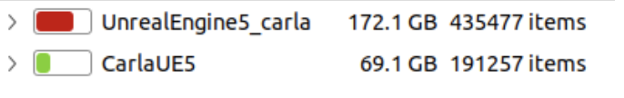

# 🚗 CARLA Unreal Engine 5.5 Installation Guide

Guide to Install CARLA on Ubuntu 22.04 with Unreal Engine 5.5

## 📋 Table of Contents

* [🛠️ Installation](#installation)
* [🐞 Troubleshooting](#troubleshooting)
* [🔗 References](#references)

---

## 🛠️ Installation

**Step 1**: Clone the CARLA repository

```bash
git clone -b ue5-dev https://github.com/carla-simulator/carla.git CarlaUE5
```

**Step 2**: Get the Unreal Engine 5.5 repository

To build CARLA, you need a specific version of Unreal Engine 5.5 prepared for CARLA.
You must connect your GitHub account to Epic Games [here](https://www.unrealengine.com/en-US/ue-on-github) to get access.

**Step 3**: Set Git local credentials

Edit your bash configuration:

```bash
code ~/.bashrc
```

Add this line at the end (replace with your info):

```bash
export GIT_LOCAL_CREDENTIALS=[Your_Username]@[Your_Token]
```

> ✏️ Replace `[Your_Username]` and `[Your_Token]` with your actual GitHub username and a personal access token.

Then reload the config:

```bash
source ~/.bashrc
```

**Step 4**: Build CARLA

```bash
cd CarlaUE5
sudo -E ./CarlaSetup.sh
```

This script will download and install Unreal Engine 5.5, install all prerequisites, and build CARLA.  
> [!NOTE]
> This process takes a long time and needs a lot of disk space.*
>
> 

---

## 🐞 Troubleshooting

### ⚠️ CMake Error

If you see an error like:

```bash
CMake Error at CMakeLists.txt:16 (cmake_minimum_required):
  CMake 3.27.2 or higher is required.  You are running version 3.22.1
```

Check which version of CMake is active:

```bash
cmake --version
# Should output: cmake version 3.28.3 (or newer)
```

But sometimes `sudo cmake --version` still shows the wrong version:

```bash
sudo cmake --version
# cmake version 3.22.1 (wrong)
```

**💡 Solution:**  
Make sure the correct version of CMake is called by the setup script.
You can edit `CarlaSetup.sh` in the `CarlaUE5` directory to explicitly use the desired CMake binary, for example:

```bash
/opt/cmake-3.28.3-linux-x86_64/bin/cmake -G Ninja -S . -B Build \
    --toolchain=$PWD/CMake/Toolchain.cmake \
    -DLAUNCH_ARGS="-prefernvidia" \
    -DCMAKE_BUILD_TYPE=Release \
    -DENABLE_ROS2=ON \
    -DPython_ROOT_DIR=${python_root} \
    -DPython3_ROOT_DIR=${python_root} \
    -DCARLA_UNREAL_ENGINE_PATH=$CARLA_UNREAL_ENGINE_PATH
```

### 🔒 Permissions Error when building

If you encounter a permissions error during the build process, it may be due to the `CarlaSetup.sh` script or build folder not having execute permissions.

**💡 Solution:**

You can fix this by running:

```bash
sudo chown -R $(whoami):$(whoami) Build/

sudo chown -R $(whoami):$(whoami) {workspace_path}/CarlaUE5/Build/
```
> For example  
> ```bash
> sudo chown -R $(whoami):$(whoami) /media/peeradon/Peeradon-SSD/CarlaUE5/Build
> ```

---

## 🔗 References

* [📚 CARLA Documentation](https://carla-ue5.readthedocs.io/en/latest/)
* [💻 CARLA GitHub Repository](https://github.com/carla-simulator/carla.git)
