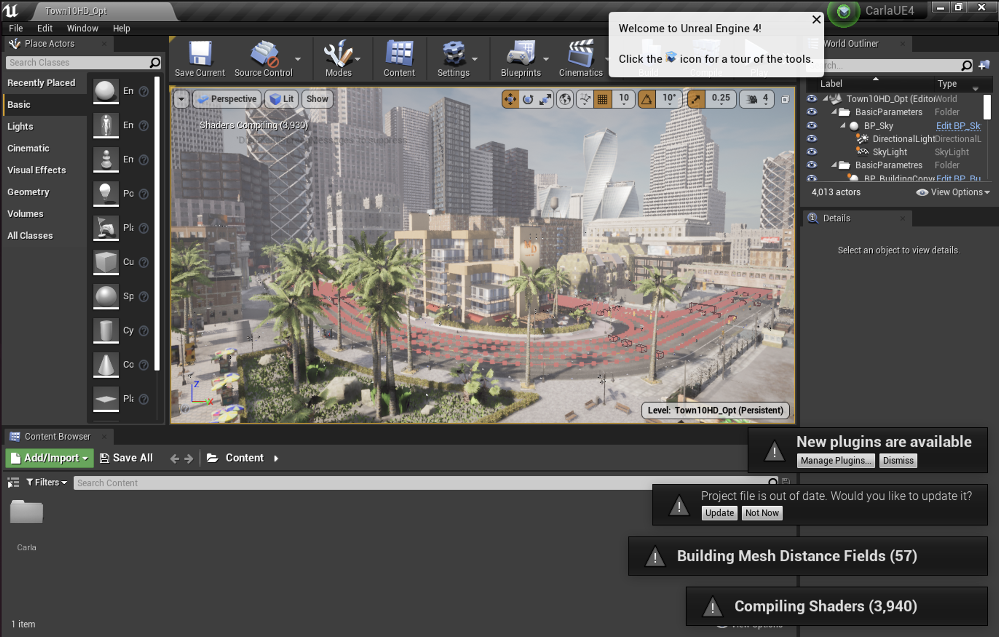

# 🚗 CARLA Unreal Engine 4 Installation Guide

Guide to install CARLA on **Ubuntu 22.04** using **Unreal Engine 4**

---

## 📋 Table of Contents

* [💻 Recommended system](#recommended-system)
* [🛠️ Installation](#installation)
* [🐞 Troubleshooting](#troubleshooting)
* [🔗 References](#references)

---


## 💻 Recommended system

* Intel i7 gen 9th - 11th / Intel i9 gen 9th - 11th / AMD Ryzen 7 / AMD Ryzen 9
* +32 Gb RAM memory 
* NVIDIA RTX 3070/3080/3090 / NVIDIA RTX 4090 or better
* 16 Gb or more VRAM
* Ubuntu 22.04 or Windows 11

## 🛠️ Installation

### **Step 1:** Install Software Requirements

```bash
sudo apt-add-repository "deb http://archive.ubuntu.com/ubuntu focal main universe"
sudo apt-get update
sudo apt-get install build-essential clang-10 lld-10 g++-7 cmake ninja-build libvulkan1 python python3 python3-dev python3-pip libpng-dev libtiff5-dev libjpeg-dev tzdata sed curl unzip autoconf libtool rsync libxml2-dev git git-lfs
sudo update-alternatives --install /usr/bin/clang++ clang++ /usr/lib/llvm-10/bin/clang++ 180 &&
sudo update-alternatives --install /usr/bin/clang clang /usr/lib/llvm-10/bin/clang 180 &&
sudo update-alternatives --install /usr/bin/g++ g++ /usr/bin/g++-7 180
```

### **Step 2:** Install python dependencies

```bash
pip install --user setuptools &&
pip3 install --user -Iv setuptools &&
pip install --user distro &&
pip3 install --user distro &&
pip install --user wheel &&
pip3 install --user wheel auditwheel==4.0.0
```

### **Step 3:** Install Unreal Engine 4

To install Unreal Engine 4, you need to have a GitHub account linked to Unreal Engine's account . If you don't have this set up, please follow [this guide](https://www.unrealengine.com/en-US/ue-on-github).

```bash
 git clone --depth 1 -b carla https://{YOUR_TOKEN}@github.com/CarlaUnreal/UnrealEngine.git ~/UnrealEngine_4.26
```
Replace `{YOUR_TOKEN}` with your GitHub personal access token.


### **Step 4:** Build and Try to run Unreal Engine 4

```bash
cd path/to/your/UnrealEngine_4.26
```
build Unreal Engine 4 by running the following command:
> [!NOTE]
> This may take an hour or two depending on your system.

```bash
  ./Setup.sh && ./GenerateProjectFiles.sh && make
```

Next try to run Unreal Engine 4:

```bash
cd path/to/your/UnrealEngine_4.26/Engine/Binaries/Linux && ./UE4Editor
```

### **Step 5:** Clone CARLA repository

```bash
git clone -b ue4-dev https://github.com/carla-simulator/carla
```

### **Step 6:** Download the latest assets

```bash
cd carla
./Update.sh
```

### **Step 7:** Set Unreal Engine environment variable

```bash
code ~/.bashrc
```
Add the following line to the end of the file:

```bash
 export UE4_ROOT=path/to/your/UnrealEngine_4.26
```

Save and close the file, then run:

```bash
source ~/.bashrc
```

### **Step 8:** Build CARLA

First Compile the Python API client

```bash
cd carla
make PythonAPI
```
Next, install python dependencies for CARLA:

```bash 
cd PythonAPI/carla/dist
pip install pip install carla-0.9.15-cp310-cp310-linux_x86_64.whl
```

Finally, Compile the server

```bash
cd carla
make launch
```

Tihs shoud show like this:




---

## 🐞 Troubleshooting


---

## 🔗 References

* [📚 CARLA Documentation](https://carla.readthedocs.io/en/latest/)
* [💻 CARLA GitHub Repository](https://github.com/carla-simulator/carla.git)

